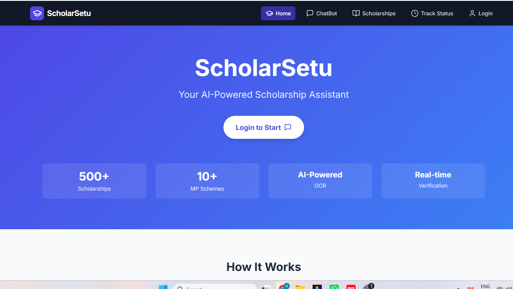
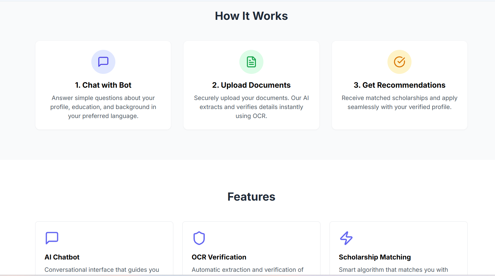
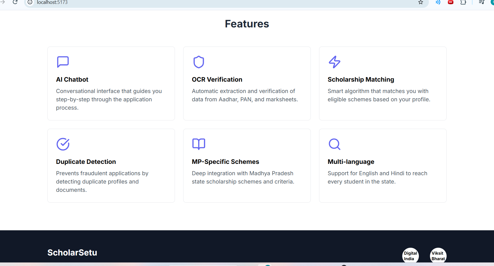
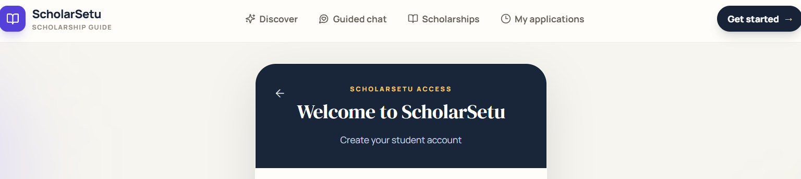
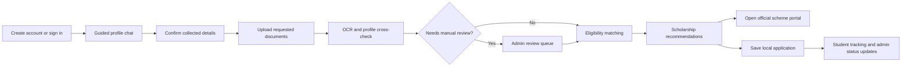
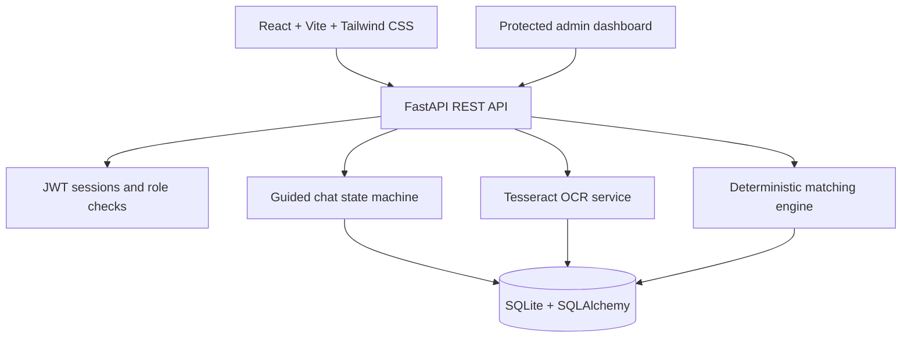

# ScholarSetu

<p align="center">
  <strong>A guided scholarship discovery and application companion for students in Madhya Pradesh.</strong><br />
  Built for the <strong>MP Online Tech Hackathon</strong> — AI innovation for public services and citizen-centric governance.
</p>

<p align="center">
  <a href="#demo-gallery">Demo</a> ·
  <a href="#student-workflow">Workflow</a> ·
  <a href="#architecture">Architecture</a> ·
  <a href="#run-locally">Run locally</a>
</p>



## The challenge

Students often need to compare scattered eligibility rules, repeat personal details on several portals, and wait for documents to be checked. These obstacles are amplified for first-time applicants, rural students, and students who prefer Hindi guidance.

## The solution

**ScholarSetu** brings the journey into one guided workspace: collect a verified profile in conversational steps, review document details, surface relevant scholarships, and keep applications visible after submission. It supports a practical human-review path for cases that need attention.

| Students get | Administrators get |
| --- | --- |
| A step-by-step profile conversation in English or Hindi | A protected queue for document and application review |
| Personalised scholarship recommendations | Clear status controls and audit-friendly records |
| OCR-assisted document upload and validation feedback | A view of student details, uploaded files, and review needs |
| Application tracking and official scheme links | A focused workflow for resolving exceptions |

## Demo gallery

<a id="demo-gallery"></a>

| Discover scholarships | Guided journey |
| --- | --- |
|  |  |

| Matching features | Account access |
| --- | --- |
|  |  |

## Student workflow



### What the prototype demonstrates

- **Guided profile collection** with validation and an explicit confirmation step before details are committed.
- **English and Hindi assistance**, with browser speech features where supported by the device.
- **Scholarship discovery** with search, filters, eligibility context, match scores, and links to scheme portals.
- **Application tracking** for students, plus form previews for supported schemes.
- **Document verification support** that extracts OCR text, compares relevant details, and routes exceptions to manual review.
- **Role-aware workspaces** for students and administrators.
- **Security foundations** including hashed passwords, JWT session handling, HttpOnly cookies, and protected API routes.

## Architecture



## Technology stack

| Layer | Tools used |
| --- | --- |
| Frontend | React 18, Vite, Tailwind CSS, React Router, Axios, Lucide |
| Backend | FastAPI, Pydantic, SQLAlchemy, Uvicorn |
| Data | SQLite with seeded scholarship schemes and application records |
| Authentication | Password hashing, JWT, secure session cookies, role checks |
| Document processing | Pillow, Tesseract OCR, manual-review fallback |
| Accessibility | Web Speech APIs for optional voice input/output; English/Hindi content |

## Scholarship data

The project ships with a seeded catalogue of Madhya Pradesh and central schemes. The matching engine evaluates profile signals such as domicile, category, family income, education, board marks, gender, rural status, and relevant achievements. Scheme information is designed for discovery and should be verified on the linked official portal before an application is submitted.

## Run locally

### Prerequisites

- Python 3.10+
- Node.js 18+
- Tesseract OCR on your `PATH` if you want OCR extraction

### 1. Clone and configure

```powershell
git clone https://github.com/harshgupta170704/ScholarShip-Helper.git
cd ScholarShip-Helper
Copy-Item .env.example backend\.env
```

Update `backend\.env` with a strong `JWT_SECRET` before using the project outside local development.

### 2. Start the API

```powershell
cd backend
py -m venv venv
.\venv\Scripts\Activate.ps1
python -m pip install -r requirements.txt
python -m uvicorn app.main:app --reload --host 127.0.0.1 --port 8000
```

The interactive API documentation is available at [http://127.0.0.1:8000/docs](http://127.0.0.1:8000/docs).

### 3. Start the web app

Open another terminal at the repository root:

```powershell
cd frontend
npm install
npm run dev -- --host 127.0.0.1 --port 5173
```

Open [http://127.0.0.1:5173](http://127.0.0.1:5173). The Vite development proxy forwards `/api` calls to the FastAPI server on port `8000`.

### Optional Google sign-in

Add the same client ID to both locations if you configure Google OAuth:

```text
frontend/.env: VITE_GOOGLE_CLIENT_ID=...
backend/.env:  GOOGLE_CLIENT_ID=...
```

## API areas

| Area | Purpose |
| --- | --- |
| `/api/auth` | Registration, login, logout, and session identity |
| `/api/chat` | Guided profile conversation and confirmation state |
| `/api/documents` | Upload, OCR extraction, and verification outcomes |
| `/api/scholarships` | Catalogue, filters, and personalised matching |
| `/api/applications` | Saved applications and student-facing status tracking |
| `/api/admin` | Protected review and application-management actions |

## Project structure

```text
ScholarShip-Helper/
├── backend/
│   ├── app/
│   │   ├── routes/              # Auth, chat, documents, scholarships, admin
│   │   ├── chatbot_service.py   # Guided data-collection flow
│   │   ├── ocr_service.py       # OCR and document checks
│   │   └── scholarship_data.py  # Seeded scheme catalogue
│   └── requirements.txt
├── frontend/
│   └── src/                     # React views, components, and API client
├── docs/images/                 # Prototype screenshots used in this README
└── .env.example                 # Local configuration template
```

## Scope and responsible use

ScholarSetu is a working prototype for scholarship discovery, guided data collection, and workflow demonstration. It links students to official scheme portals and keeps a local application workflow; it does not submit applications to government systems on a student’s behalf. Production use requires review of scheme data, consent and privacy controls, operational security, accessibility testing, and integration approval from each relevant portal.

## Repository

[github.com/harshgupta170704/ScholarShip-Helper](https://github.com/harshgupta170704/ScholarShip-Helper)
